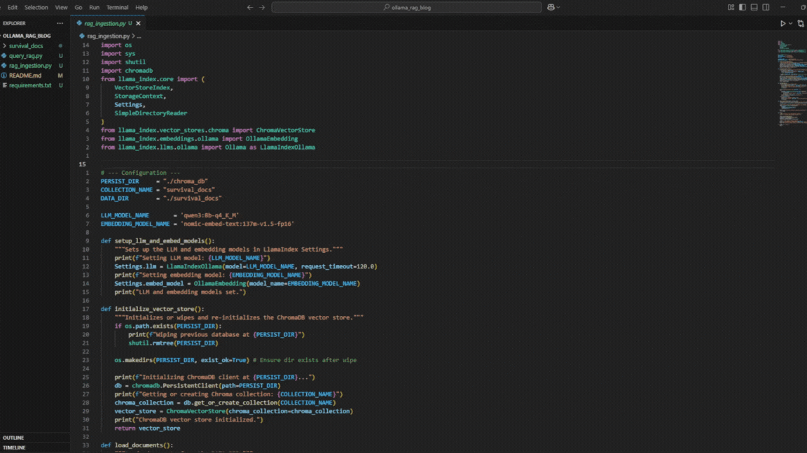

# Ollama RAG Blog

This project demonstrates how to set up a Retrieval-Augmented Generation (RAG) pipeline locally using:
- **Ollama** (for running large language models and embeddings)
- **ChromaDB** (vector database)
- **llama-index** (for building and querying vector-based indexes)

With this setup, you can ingest PDF or text documents and chat with them interactively.



## Table of Contents
- [Prerequisites](#prerequisites)
- [Installation](#installation)
- [Model Setup](#model-setup)
- [Project Structure](#project-structure)
- [Usage](#usage)
- [Adding Your Own Documents](#adding-your-own-documents)
- [Troubleshooting](#troubleshooting)

## Prerequisites

- **Operating System**: macOS, Linux, or Windows (via WSL or native)
- **Python**: version 3.8 or higher
- **pip**: Python package manager
- **Virtual environment** (recommended)
- **Ollama CLI**: for hosting and running LLMs locally

## Installation

1. Clone this repository:

   ```bash
   git clone https://github.com/yourusername/ollama_rag_blog.git
   cd ollama_rag_blog
   ```

2. (Optional) Create and activate a Python virtual environment:

   ```bash
   python3 -m venv venv
   source venv/bin/activate
   ```

3. Install Python dependencies:

   ```bash
   pip install -r requirements.txt
   ```

4. Install the Ollama CLI:

- **macOS (Homebrew)**:
  ```bash
  brew install ollama
  ```

- **Linux**:
  Download the latest release from the [Ollama Releases page](https://github.com/ollama/ollama/releases), extract, and move the binary to your `PATH`.
- **Windows**:
  Download the latest Windows release from the [Ollama Releases page](https://github.com/ollama/ollama/releases), extract, and add `ollama.exe` to your `PATH`. For detailed instructions, see the Ollama documentation.

For full installation instructions, see the Ollama documentation: https://docs.ollama.com/installation

## Model Setup

> **Note**: By default, the scripts use the following models:
> - LLM: `qwen3:8b-q4_K_M`
> - Embedding: `nomic-embed-text:137m-v1.5-fp16`
>
> You can change the model names by editing `rag_ingestion.py` and `query_rag.py` (`LLM_MODEL_NAME` and `EMBEDDING_MODEL_NAME`).
> You can explore more models at https://ollama.com/search to find models that best suit your hardware and use-case.

1. Pull the LLM model:

   ```bash
   ollama pull qwen3:8b-q4_K_M
   ```

2. Pull the embedding model:

   ```bash
   ollama pull nomic-embed-text:137m-v1.5-fp16
   ```

## Project Structure

```
.
├── README.md            # This file
├── requirements.txt     # Python dependencies
├── rag_ingestion.py     # Ingest documents into ChromaDB
├── query_rag.py        # Interactive RAG chat interface
└── survival_docs/      # Sample PDF(s) for ingestion
    └── SODIS-manual.pdf
```

## Sample Data

The sample PDF (`SODIS-manual.pdf`) in the `survival_docs/` directory was sourced from the Seasoned Citizen Prepper site:

https://seasonedcitizenprepper.com/preparedness-downloads/

This page contains a collection of 667 survival manuals, books, guides, and PDFs that you can download to expand your document set.

## Usage

1. Ensure you have added PDF or text files to the `survival_docs/` directory.

2. Ingest the documents into ChromaDB:

   ```bash
   python rag_ingestion.py
   ```

   This script will:
   - Configure the LLM and embedding models
   - Wipe any existing vector store at `./chroma_db`
   - Read documents from `survival_docs/`
   - Create an index and persist it under `./chroma_db`

3. Start the interactive chat interface:

   ```bash
   python query_rag.py
   ```

   - Type your questions at the prompt.
   - Type `quit` or `exit` to end the session.

## Adding Your Own Documents

1. Place your PDF or text files into the `survival_docs/` directory.
2. Rerun:
   ```bash
   python rag_ingestion.py
   ```
3. Then run:
   ```bash
   python query_rag.py
   ```

## Troubleshooting

- **Command not found: `ollama`**  
  Make sure the Ollama CLI is installed and available in your `PATH`.

- **Missing models or failed pull**  
  Verify the model names and pull them again:
  ```bash
  ollama pull qwen3:8b-q4_K_M
  ollama pull nomic-embed-text:137m-v1.5-fp16
  ```

- **No documents found**  
  Ensure you have added files to `survival_docs/` before running `rag_ingestion.py`.

For more information, see:
- llama-index docs: https://gpt-index.readthedocs.io/
- ChromaDB docs: https://docs.trychroma.com/
